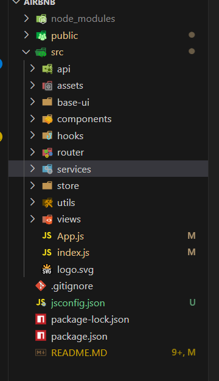

# 项目规范
+ 文件夹,文件名统一小写,多个单词以连接符(_)连接;
+ `JavaScript`变量名称采用小驼峰写法,常量全部使用大写字母,组件采用大驼峰;
+ `CSS`采用`CSS`和`style-component`结合来编写,避免`CSS`污染;
+ 整个项目不再使用`Class`组件,统一使用函数式组件;
+ 所有的函数式组件,为了避免不必要的渲染,都使用`memo`包裹;
+ 组件内部的状态,使用`useState`、`useReducer`来管理,业务数据全部放在`Redux`中管理;
+ 函数组件内部基本按照如下顺序编写代码:
  1\. 组件内部`state`管理;
  2\. `Redux`的`hooks`代码;
  3\. 其它`hooks`相关代码(比如自定义`hooks`);
  4\. 其它逻辑代码;
  5\. 返回`JSX`代码
+ `Redux`代码规范如下:
  1\. 每个模块有自己独立的`reducer`或者`slice`,之后合并在一起;
  2\. `Redux`中会存在共享的状态,从服务器获取到的数据状态;
+ 网络请求采用`axios`
  1\. 对`axios`二次封装;
  2\. 多有的模块请求会放到一个请求文件中单独管理;
+ 项目中使用`Ant Design`、`MUI(Material UI)`

# 项目依赖
+ `react-router-dom`: 路由
+ `react-redux`: `Redux`的`hooks`支持
+ `redux-toolkit`: 更简洁的`Redux`管理
+ `axios`: 网络请求
+ `react-dom`: `react`组件
+ `react`: `react`核心
+ `antd`: `Ant Design`组件
+ `classnames`: `CSS`类名控制
+ `style-component`:`CSS`编写插件
+ `craco`: `create-react-app`的配置插件

# 创建React项目
### 创建方式
+ 方式一: `create-react-app`创建
```
npx create-react-app my-app
cd my-app
npm start
```
+ 方式二:使用`vite`创建
```
npm create vite@latest my-react-app --template react
cd my-react-app
npm install
npm run dev
```  
+ 方式三:使用`Next.js`-适合服务端渲染的场景
```
npx create-next-app@latest
# 按照提示操作
cd my-next-app
npm run dev
```

### 项目配置(`index.html`中的配置)
+ 配置项目的`icon`图标
+ 配置项目的标题
+ 配置`jsconfig.json`
+ 通过`craco`配置别名和`less`文件

### 目录结构


### CSS样式重置
+ `normalize.css`: 样式重置,兼容性更好,`npm install normalize.css`
+ `reset.css`: 自己编写的重置样式

### 路由配置
```
<!-- 安装路由 -->
npm install react-router-dom
<!-- 在index.js中引入路由 -->
import { BrowserRouter } from 'react-router-dom';
<!-- 使用BrowserRouter或者HashRouter包裹整个项目 -->
<BrowserRouter>
  <App />
</BrowserRouter>
<!-- 在router文件夹新建`index.js`文件,并导出路由配置 -->
const routes = []
export default routes;
<!-- 在我们的App根组件中,通过`useRoutes`是我们的路由配置文件 -->
import { useRoutes } from 'react-router-dom';
import routes from './router';
<div>{useRoutes(routes)}</div>

```
+ `BrowserRouter`: 根据`history`模式来管理路由;
+ `HashRouter`: 根据`hash`模式来管理路由
+ `useRoutes`: 用来渲染路由配置文件;
+ `React.lazy`: 懒加载组件;
+ `Suspend`: 配合`React.lazy`使用,用来处理懒加载组件的加载状态;
+ `Routes`: 用来包裹所有的路由;
+ `Route`: 用来配置路由;
+ `Outlet`: 用来渲染子路由;

### Redux配置
```
<!-- 安装redux相关依赖 -->
npm install @reduxjs/toolkit react-redux
<!-- 创建store文件,并导出store -->
import { configureStore } from '@reduxjs/toolkit';
const store = configureStore({
  reducer: {},
});
export default store;
<!-- 在index.js中引入store -->
import { Provider } from 'react-redux';
import store from './store';
<!-- 在App根组件中,通过Provider包裹整个项目,并传递store -->
<Provider store={store}>
  <App />
</Provider>
```
+ `configureStore`: 用来创建`store`;
+ `Provider`: 用来包裹整个项目,并传递`store`;

### `Redux`模块配置
```
<!-- 在store文件夹中创建features文件夹,并在该文件夹下面创建对应的js文件,并导出对应的reducer -->
import { createSlice } from '@reduxjs/toolkit';
const slice = createSlice({
  name: 'user', // 模块名称
  initialState: {}, // 初始状态
  reducers: {}, // reducer函数
  extraReducers: {}, // 异步请求的reducer函数
  }
  <!-- 导出reducer -->
  export default slice.reducer;
  <!-- 导出actionCreator -->
  export const { reducer: userReducer } = slice;
  <!-- 在store文件夹中的index.js中合并reducer -->
```
+ `createSlice`: 用来创建`reducer`;

### 网络请求配置 `axios`

### `UI`组件库配置
+ 在`React`项目中,我们通常会使用`Ant Design`或者`MUI(Material UI)`,通过如下方式安装:
  ```
  <!-- 安装MUI -->
  npm install @mui/material @mui/styled-engine-sc styled-components
  <!-- 因为`MUI`使用的是`styled-components`,需要进行配置别名 -->
  webpack:{
    alias: {
      '@mui/styled-engine': '@mui/styled-engine-sc'
    }
  }
  <!-- 在index.js中通过MUI的主题进行配置 -->
  import { ThemeProvider, createTheme } from '@mui/material/styles';
  const theme = createTheme({})
  <ThemeProvider theme={theme}>
    <App />
  </ThemeProvider>
  <!-- 组件中使用`MUI` -->
  import { Button } from '@mui/material';
  <Button>按钮</Button>

  <!-- 安装Ant Design -->
  npm install antd

  ```

### 项目部署
+ 购买云服务器,比如阿里云、腾讯云等;
+ 连接云服务器,通过`ssh`连接;
  ```
  <!-- 通过命令行安装 -->
  ssh root@123.57.108.196
  <!-- 通过vscode提供的`Remote SSH`插件 -->
  <!-- 连接成功后,会在vscode中显示对应的文件结构 -->
  ```
+ 本地项目打包,通过`npm run build`命令;
+ 部署方式:
  1\. 本地项目打包,通过`npm run build`命令,将打包后的文件上传到云服务器上;
  2\. 通过`Jenkins`进行自动化部署,在服务器上安装`Jenkins`,配置自动化部署的脚本;
  ```
  <!-- Jenkins依赖Java,需要安装Java,这里要注意,最新的Jenkins要求Java版本最低位11,推荐11版本-->
  dnf search java // 查找Java
  dnf install java-11-openjdk // 安装Java
  <!-- 安装Jenkins -->
  在dnf中找不到Jenkins,需要自己去下载Jenkins
  wget -O /etc/yum.repos.d/jenkins.repo http://pkg.jenkins-ci.org/redhat-stable/jenkins.repo
  <!-- 导入GPG密钥,确保软件的合法性 -->
  rpm --import https://pkg.jenkins.io/redhat-stable/jenkins.io.key
  <!-- 或者 -->
  rpm --import http://pkg.jenkins-ci.org/redhat/jenkins-ci.org.key
  <!-- 编辑一下文件/ect/yum.repos.d/jenkins.repo -->
  vim /etc/yum.repos.d/jenkins.repo //通过`Vim`打开文件
  <!-- 在命令行按下 i -->
  <!-- 然后将下面的内容复制粘贴到命令行中 -->
  [jenkins]
  name=Jenkins-stable
  baseurl=http://pkg.jenkins.io/redhat
  gpgcheck=1
  <!-- 按下 esc,然后将刚才的内容保存下来,按下`Shift`+`:`，然后输入`wq`,敲下回车-->
  <!-- 安装Jenkins -->
  dnf install jenkins
  <!-- 启动Jenkins -->
  systemctl start jenkins
  <!-- 查看jenkins状态 -->
  systemctl status jenkins
  <!-- 设置jenkins开机重启 -->
  systemctl enable jenkins
  <!-- 查看jenkins是否安装成功,jenkins默认监听8080端口 -->
  <!-- 在云服务器中需要将8080端口添加到安全组中,否则无法访问jenkins -->
  <!-- 设置完成后,在浏览器输入ip地址:8080,可以打开jenkins界面 -->
  <!-- 解锁Jenkins -->
  <!-- 查看初始密码 -->
  cat /var/lib/jenkins/secrets/initialAdminPassword
  <!-- 输入初始密码,然后就可以登录jenkins了 -->
  <!-- 安装插件,一般选择推荐插件选项即可 -->

  <!-- 创建git仓库,上传本地项目代码 -->
  git remote add origin git@123.57.108.196:root/test.git
  <!-- 本地分支是为master,该命令会将本地的master分支该为main -->
  git branch -M main
  git push -u origin main

  ```


### 项目开发问题
##### 问题一: `react`脚手架隐藏配置文件
+ 解决方式一: 通过运行`npm run eject`命令,将配置文件暴露出来;
+ 解决方案二: 使用`craco`,通过配置文件的方式来修改默认的配置;
  ```
   <!-- 安装craco -->
   npm install craco --save-dev
   <!-- 修改package.json中的scripts -->
   "scripts": {
    "start": "craco start",
    "build": "craco build",
    "test": "craco test"
   }
   <!-- 创建craco.config.js文件 -->
   修改配置文件内容
   ```
   配置文件内容如下:
   

##### 问题二:`svg`图片的使用
+ 方式一: 当做一张图片来使用,通过`img`标签引入;
+ ```
  
  ```
+ 方式二: 直接将`svg`文件写到`JSX`中,通过`svg`标签引入;
+ ```
  <div>
    <svg></svg>
  </div>
  ``` 

##### 问题三:主题样式的设置
+ 方式一: 通过`css`变量来定义主题样式;
  ```
  :root {
    --color-primary: #fff;
  }
  <!-- 在组件中使用变量 -->
  .test {
    color: var(--color-primary);
  }
  ```
+ 方式二:通过`styled-components`提供的`ThemeProvider`来设置主题样式;
  ```
  <!-- 定义样式对象 -->
  const theme = {
    color: {
      primary: '#fff',
    },
  }
  <!-- 在index.js中引入ThemeProvider -->
  import { ThemeProvider } from 'styled-components';
  <ThemeProvider theme={theme}>
    <App />
  </ThemeProvider>
  <!-- 在style.js中使用 -->
  const Test = styled.div`
    color: ${(props) => props.theme.color.primary};
  `
  <!-- 在函数式组件中使用 -->
  import { useTheme } from 'styled-components';
  const theme = useTheme();
  ```
##### 问题四: `webpack`中引入本地静态图片
+ 方式一: 通过`import`引入图片,并通过`src`属性来引入图片;
  ```
  <!-- 引入图片 -->
  import img from './test.png';
  <!-- 使用图片 -->
  
  <!-- 在styled-components中使用图片 -->
  const Test = styled.div`
    background-image: url(${img});
  `
  ```
+ 方式二: 通过`require`引入图片,并通过`src`属性来引入图片;
  ```
  
  <!-- 在styled-components中使用图片 -->
  const Test = styled.div`
    background-image: url(${require('./test.png')});
  `
  ```
+ 方式三:在`vue`中可以通过`~assets`来引入静态资源;
  + `vue-loader`在解析`vue`文件时,会将`~assets`解析为`src/assets`目录;